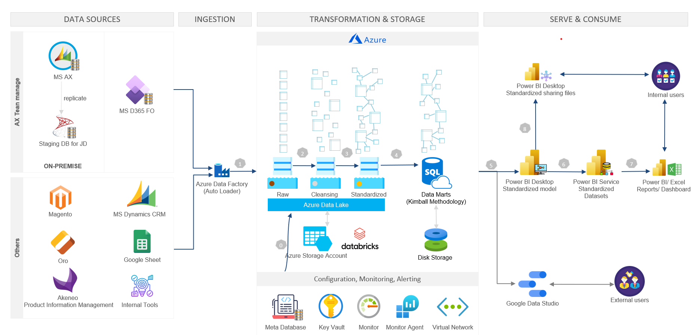

# Scalable Data Solutions for Retail Food Group

## Project Introduction: 
Modernizing Data and Analytics for Retail Food Group
As part of the Retail Food Group project, I played a pivotal role in transforming their data and analytics capabilities to support their rapid growth across Southeast Asia Region. The existing data warehouse and analytics solution could no longer meet the business's agility demands or provide timely and actionable insights. Our goal was to design and implement a modernized data platform that enhanced performance, scalability, and ease of use while reducing manual efforts in operations and maintenance.

## Challenges Addressed:

* The existing data warehouse struggled to ingest and process data from various sources, limiting business agility and timely access to insights.
* Complex data integration, security, and scalability requirements needed to be addressed to support both internal and external users.
* Manual operations and maintenance processes were time-consuming and prone to errors, which impacted data reliability and user trust.

## Technologies Used:

* **Microsoft Azure:** Leveraged Azure Data Lake, Azure SQL Database, and Azure Data Factory for data ingestion, storage, and transformation.
* **Databricks:** Utilized for big data processing, machine learning integration, and collaborative analytics development.
* **ETL with Python & SQL:** Built custom data pipelines using Python, Jinja, and SQL to manage data snapshots, transformations, testing, and deployment.
* **Power BI & Metabase:** Migrated existing dashboards to Power BI and developed a centralized BI environment to support self-service analytics.
* **Google Data Studio:** Integrated for external user reporting.

## Achievements:

1. **Scalable Data Platform:** Designed and implemented a data lake architecture on Microsoft Azure, capable of ingesting data from multiple sources (on-premise, cloud, and online services) into a unified data warehouse with over 900 tables, including 298 fact tables and 434 dimension tables.
2. **Improved Data Operations: **Centralized monitoring and error tracking in Azure, reducing operational overhead and enabling quick identification and resolution of issues.
3. **Enhanced Data Security:** Developed a flexible data security model in Azure SQL Database, implementing row-level security, data encryption, and data masking to protect sensitive data.
4. **Business Intelligence Enablement:** Migrated and replicated dashboards from Metabase to Power BI, serving over 300 users with a unified, self-service BI platform.
5. **Cost-Effective Solution:** Leveraged open-source tools and Azure’s pay-as-you-go model to deliver a cost-effective solution while maximizing ROI for the client.
   
## Solution:

  
<em>High Level Architecture</em>

1. **Data Ingestion and Transformation:** We designed and developed data pipelines using Azure Data Factory to ingest data from multiple sources (e.g., Microsoft AX, Dynamics 365, Magento, Google Sheets) into the Raw Zone of the Data Lake. This data was then cleansed, validated, and transformed into standardized business concepts within the Cleansing and Standardized Zones using Databricks and Python-based ETL processes.

2. **Data Storage and Security:** Data was organized in the Standardized Zone, which acted as an automatic data warehouse. From there, data was populated into Azure SQL Database, where advanced security features like row-level security and data masking were applied to protect sensitive information.

3. **Business Intelligence:** We collaborated with data modelers to develop standardized data models that were published to Power BI. This allowed business users to easily create and view reports and dashboards, as well as perform self-service analytics in Power BI and Excel.

4. **Operational Improvements:** By centralizing data operations and monitoring in Azure, we streamlined the process of managing data pipelines and troubleshooting issues, significantly reducing manual efforts and improving the overall reliability of the data platform.

5. **Vendor Independence and Flexibility:** The solution combined the flexibility of open-source tools with the scalability and security of Azure, ensuring the client could adapt to future business needs, onboard new data sources, and integrate AI/ML capabilities when ready.